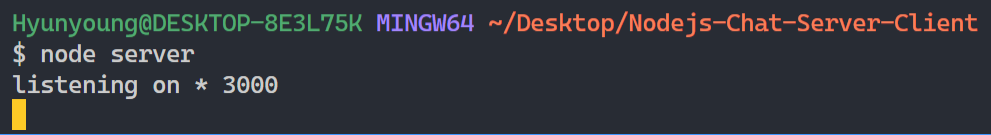
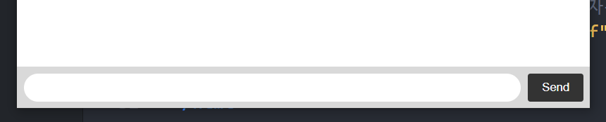

# 채팅 만들기

## 1. 환경 설정

- `$ npm init --yes`
- `$ npm install --save --save-exact socket.io express`
- 서버 실행 명령
  - `$ node server`


## 2. 서버 생성

- 핸들러의 개념은 추후에 다시 공부해야겠다.

```js
// server.js

// require 메서드로 'express' 모듈 가져오기
// app을 함수 핸들러로써 초기화
const app = require('express')()

// express로 서버 생성
// .Server === http.createServer 
// 참고: https://stackoverflow.com/questions/26921117/http-createserverapp-v-http-serverapp
const http = require('http').Server(app)

// socket.io를 불러온 후 생성된 서버를 할당 
const io = require('socket.io')(http)
```


## 3. Route Handler 작성

```js
// client가 최초 접속 시 보여지는 화면 => 홈페이지

// 아래 코드를 route handler라고 한다. django의 urls + view 느낌이다.
// django에서 views 함수 같이, request를 받으면 response를 보낸다는 의미이다.

app.get('/', function(req, res) {
  res.send('<h1> Hello world </h1>')
})

// 서버 실행 및 작동 확인
// 얘 없으면 동작을 안 한다.
http.listen(3000, () => {
  console.log('listening on * 3000')
})
```

- 콘솔 확인



- [브라우저 확인](http://localhost:3000)


## 3. Route Handler 리팩토링

- 이제 Hello World 대신 우리가 작성할 index.html 파일을 브라우저에 띄울 것이다.
- sendFile 메서드를 이용해서 응답에 index파일을 실어 보내자.

```js
app.get('/', function(req, res) {
  // res.send('<h1> Hello world </h1>')
    
  // __dirname 뒤에 , 붙여서 1시간을 헤맸다
  res.sendFile(__dirname + '/index.html')
})
```


## 4. html 파일 기본 작업



- 처음 써보는 기능들 두 개만 서술
- `flex-grow`
  - display: flex로 지정된 box의 하위 요소에 적용되는 속성이다.
  - flex-grow가 적용된 개체의 넓이는 다음과 같이 적용된다.
  - 부모 box의 content 넓이 X 하나의 자식 요소의 flex-grow 값 / 자식 요소들에게 적용된 모든 flex-grow 값의 합
  - 일반적으로 flex-basis(기본값)과 같이 사용된다는데, 이 부분은 아직 잘 모르겠다.
- `autocomplete='off'`
  - 자동완성을 끈다.

```html
<!DOCTYPE html>
<html>
  <head>
    <title>Socket.IO chat</title>
    <style>
      body { margin: 0; padding-bottom: 3rem; font-family: -apple-system, BlinkMacSystemFont, "Segoe UI", Roboto, Helvetica, Arial, sans-serif; }

      #form { background: rgba(0, 0, 0, 0.15); padding: 0.25rem; position: fixed; bottom: 0; left: 0; right: 0; display: flex; height: 3rem; box-sizing: border-box; backdrop-filter: blur(10px); }
      #input { border: none; padding: 0 1rem; flex-grow: 1; border-radius: 2rem; margin: 0.25rem; }
      #input:focus { outline: none; }
      #form > button { background: #333; border: none; padding: 0 1rem; margin: 0.25rem; border-radius: 3px; outline: none; color: #fff; }

      #messages { list-style-type: none; margin: 0; padding: 0; }
      #messages > li { padding: 0.5rem 1rem; }
      #messages > li:nth-child(odd) { background: #efefef; }
    </style>
  </head>
  <body>
    <ul id="messages"></ul>
    <form id="form" action="">
      <input id="input" autocomplete="off" /><button>Send</button>
    </form>
  </body>
</html>
```


## 5. Server - Html 연결 상태 유지

- on 메서드
  - 현재 접속되어 있는 클라이언트로부터 메시지를 수신한다.
  - io나, socket등에 달아서 사용한다.
- connection 이벤트
  - socket.io의 기본 이벤트
  - 사용자가 웹사이트에 접속하면 자동으로 발생하는 이벤트

```js
// server.js

io.on('connection', (socket) => {
  console.log('a user connected');
});
```

- 아래 코드가 없으면, 서버와 연결이 안 된다. 즉 처음에 페이지는 보내지는데 이후에 페이지가 지속적으로 연결되지 않는다.

```html
<!-- index.html의 body 끝 -->

<script src="/socket.io/socket.io.js"></script>
<script>
  const socket = io();
</script>
```

- socket
  - connection이 성공했을 때, connection에 대한 정보를 담고 있는 인자.
  - 연결된 상태에서 신호를 받고 행동하기 때문에, io.on의 콜백 함수 안에 정의해준다.

```js
// server.js
io.on('connection', (socket) => {
  console.log('a user connected');
  
  socket.on('disconnect', () => {
  console.log('user disconnected');
  });  
});
```


## 6. 메시지 보내기(Emit)

- 브라우저에서 이벤트가 발생하면, 서버로 보내야 한다.
- Vue.js에서 썼던, emit을 쓴다.
  - 전송이 완료된 후 커서가 가 있도록 focus()를 추가한다.

```html
<!-- index.html -->

<script>
  const socket = io();

  const form = document.getElementById('form')
  const input = document.getElementById('input')

  form.addEventListener('submit', event => {
    event.preventDefault()
    // input 안의 value가 존재하면 전송
    // event.target.data 이런거 아니다.
    const message = input.value
    if (message) {
      // 전송 완료 후 빈칸으로 만들어준다.
      // 계속 커서가 input으로 가 있게 focus()를 추가한다
      socket.emit('chatMessage', message)
      input.value = ''
    }
    input.focus()
  })
</script>
```

```js
// server.js

// 서버와 실시간 연결
io.on('connection', socket => {
  console.log('user connected')

  // 서버와 연결 끊어짐
  socket.on('disconnect', () => {
    console.log('user disconnected')
  })

  // 서버가 보낸 메시지 수신
  socket.on('chatMessage', message => {
    console.log(message)
  })
})
```


## 7. 메시지를 모든 클라이언트에 보내기

- 메시지를 클라이언트에게 보내는 방법은 두 가지가 있다.

1. `socket.broadcast`
   - 메시지를 emit한 socket을 제외하고, 다른 소켓들에게 받은 메시지를 전송한다.
   - 채팅에서의 사용 예를 들자면, 입장했을 때는 자신을 제외한 다른 사람들에게 입장한 걸 알릴 때 등에 사용된다.

```js
// broadcast 예시

io.on('connection', (socket) => {
  // 받은 놈한테는 제외하고 보낸다.
  socket.broadcast.emit('hi');
});
```

2. `io.emit`
   - 메시지를 보낸 클라이언트를 포함한 모든 클라이언트에 메시지를 전송한다.
   - 채팅에서의 사용 예를 생각하면, 일반적인 채팅에 사용된다.

```js
// io.emit 예시

io.emit('some event', { someProperty: 'some value', otherProperty: 'other value' });
```


- 위에서 chatMessage 이벤트로 받은 message를 모든 사람들에게 전송한다.

```js

// 서버와 실시간 연결
io.on('connection', socket => {
  console.log('user connected')

  // 서버와 연결 끊어짐
  socket.on('disconnect', () => {
    console.log('user disconnected')
  })

  // 서버가 보낸 메시지 수신 후 모두에게 전송
  socket.on('chatMessage', message => {
    io.emit('chatMessage', message)
  })
})

```

- 모두에게 보낸 메시지를 받아서 화면에 표시한다.
  - js 파일에서와 마찬가지로, html 파일에서도 보낸 메시지를 수신할 때 `.on` 메서드를 사용한다.
- `window.scrollTo(x-좌표, y좌표)`
  - 문서의 지정된 위치로 스크롤한다.
  - x 좌표에는 0, y 좌표에는 document.body.scrollHeight를 넣음으로써 문서의 맨 아래로 자동 스크롤을 할 수 있다.
  - scrollHeight는 이름과는 달리, 요소에 들어 있는 컨텐츠의 전체 높이이다.
    - body의 전체 높이만큼 밑으로 이동하므로, 결국은 글들의 맨 아래로 이동하게 된다.

```html
<!-- index.html -->

<script src="/socket.io/socket.io.js"></script>
    <script>
      const socket = io();

      const form = document.getElementById('form')
      const input = document.getElementById('input')

      const message = document.getElementById('messages')

      form.addEventListener('submit', event => {
        event.preventDefault()
        // input 안의 value가 존재하면 전송
        const message = input.value
        if (message) {
          socket.emit('chatMessage', message)
          input.value = ''
        }
      })

      socket.on('chatMessage', message => {
        const item = document.createElement('li')
        item.innerText = message
        messages.appendChild(item)
        window.scrollTo(0, document.body.scrollHeight)
      })
    </script>
```


# 나머지는 여러분의 손에 맡깁니다.
